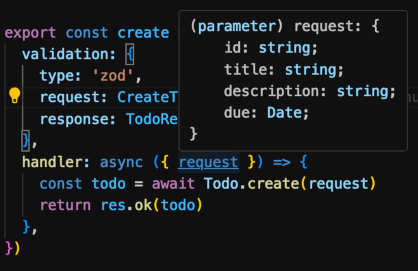
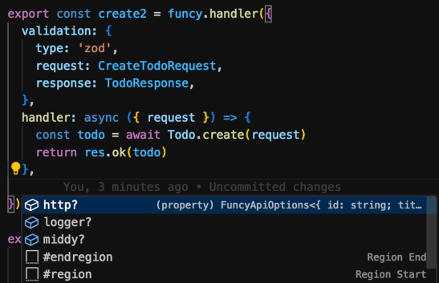

<p align="center">
  
  <h1 align="center">funcy</h1>
  <p align="center">
    <br/>
    TypeScript-first, functional interface for AWS lambda handlers
    <br />
  </p>
</p>
<!-- <p align="center">
<a href="https://github.com/colinhacks/zod/actions?query=branch%3Amaster"></a>
<a href="https://twitter.com/colinhacks" rel="nofollow"></a>
<a href="https://opensource.org/licenses/MIT" rel="nofollow"></a>
<a href="https://www.npmjs.com/package/zod" rel="nofollow"></a>
<a href="https://www.npmjs.com/package/zod" rel="nofollow"></a>
<a href="https://discord.gg/KaSRdyX2vc" rel="nofollow"></a>
</p> -->

<div align="center">
  <a href="#">docs</a>
  <span>&nbsp;&nbsp;•&nbsp;&nbsp;</span>
  <a href="https://www.npmjs.com/package/@refactorthis/funcy">npm</a>
  <span>&nbsp;&nbsp;•&nbsp;&nbsp;</span>
  <a href="https://github.com/refactorthis/funcy/issues/new">issues</a>
</div>

<br />

## Table of Contents

- [Table of Contents](#table-of-contents)
- [Introduction](#introduction)
- [Preview](#preview)
- [Installation](#installation)
- [Getting Started](#getting-started)
- [Examples](#examples)
- [API](#api)
- [Complementing Packages](#complementing-packages)
- [Performance Comparisons](#performance-comparisons)
- [Roadmap](#roadmap)
- [Technologies](#technologies)

## Introduction

**funcy** provides a fully-typed, functional interface for AWS lambda handlers. The perfect complement to serverless frameworks such as serverless.yml, SST.dev, SAM, etc.

It provides out-of-the-box serialisation/deserialisation to typed models to TypeScript models, validation, and handles common http concerns such as CORS, content negotiation, encoding, etc. in a simple interface.

The key design principles of funcy are as follows:

- Sensible Defaults - Best practice and sensible options by default. Get going straight away.
- Progressive Disclosure - We keep interfaces simple and abstracted. Everything should be customisable, but hidden by default. See [progressive disclosure](https://en.wikipedia.org/wiki/Progressive_disclosure).
- All-In-One - Find everything you need by code-completion. No need to go searching on npm or google to install other packages, this is an all-in-one framework.
- Performant - lazy loading, tree shaking, and profiling of pipelines.
- Extensible - Add middy middleware to extend the pipeline where needed.

If you like lightweight lambda functions and don't want a full-blown framework like Nest.js, then this is for you.

## Preview

The example below shows parsing, validating and creating a strongly-typed model for both request and response. You'll notice that the handler itself does not contain any parsing, validation or error handling logic, we adhere to the single-responsibility-principle here and handle all other aspects in middleware, configurable at either api or handler level.

```typescript
import { api, res } from '@funcy/api'

// create customer handler
export const create = api.handler({
  validation: {
    type: 'zod',
    request: CreateCustomerRequest // zod schema,
    response: CreateCustomerResponse // zod schema,
  },
  handler: async ({ request }) = {
    const response = await Customer.create(request)
    return res.ok(response)
  }
})
```

As you can see, the TypeScript type is inferred at compile time, allowing strong typing of all request and response parameters to your API.



funcy also has a full middleware pipeline, allowing you to control things like CORS, content negotiation, encoding, security header best practices, etc. all out of the box. All you need to do is ctrl+space to see the options. Options can either be set as default for the whole api, or overridden for each handler



## Installation

```bash
pnpm add @funcy/api
#bun add @funcy/api
#yarn add @funcy/api
#npm install --save-dev @funcy/api
```

## Getting Started

To get started let's create a simple API Gateway Proxy (HTTP or REST) lambda handler. This will validate the request and the response with our predefined zod schemas.

```typescript
import { api, res } from '@funcy/api'

export const handler = api.handler({
  validation: {
    type: 'zod',
    request: MyRequest,
    response: MyResponse,
  },
  handler: async({ request }) = {
    // request is the strongly typed request body
    // response is also validated and strongly typed
    return res.ok(response)
  }
})
```

You can create your own api handlers using api-level defaults. For instance, let's use a custom authorizer context, with strongly typed claims, for use across all of our api.

```typescript
// base-api-handler.ts
import { api } from '@funcy/api'

// my authorizer struct
interface AuthorizerType {}

// Create this once for your API and share it
export default api.create<AuthorizerType>()
```

```typescript
// customers-create.ts
import { res } from '@funcy/api'
import api from './base-api-handler.ts'

export const handler = api({
  handler: async({ request, path, query, event, authorizer }) = {
    // request is the strongly typed request body
    // path is the strongly typed url path
    // query is the strongly typed query string
    // event is the raw AWS API proxy event, in case you need it
    // authorizer is the authorizer context as specified in base-api-handler.ts, including strongly typed claims
    // responseType is the strongly typed response type
    return res.ok(responseType)
  }
})
```

## Examples

Let's create CRUD handlers for the "Customer" domain, with request validation.

```typescript
import { api, res } from '@funcy/api'

// create
export const handler = api.handler({
  validation: {
    type: 'zod',
    request: CreateCustomerRequest,
    response: CreateCustomerResponse,
  },
  handler: async ({ request }) = {
    const response = await Customers.create(request)
    return res.created(response)
  }
})

// get
export const handler = api.handler({
  validation: {
    type: 'zod',
    path: GetResourcePath,
    response: GetCustomerResponse,
  },
  handler: async ({ request, path }) = {
    const response = await Customers.get(path.id)
    return res.ok(response)
  }
})

// list
export const handler = api.handler({
  validation: {
    query: ListQueryStringValidator,
  },
  handler: async ({ request, query }) = {
    const { skip, take } = query
    const items = await Customers.list(skip, take)
    return res.ok({ items, skip, take })
  }
})

// update
export const handler = api.handler({
  validation: {
    type: 'zod',
    request: UpdateCustomerRequest,
    response: UpdateCustomerResponse,
    path: GetResourcePath,
  },
  handler: async ({ request, path }) = {
    const response = await Customers.update(path.id, request)
    return res.ok(response)
  }
})
```

## API

```typescript
// create this once for your api
const apiHandler = new api.create<AuthorizerType?, AWSEventType?, AWSResultType?>(defaults?: {
    // see options section
})

// each handler
export const handler = apiHandler<ResponseType, RequestType, PathType, QueryStringType>({
  {
  /**
   * The strongly-typed lambda function handler
   */
  handler: ApiHandlerFunc<TResponse, TRequest, TPath, TQuery, TAuthorizer, TEvent>

  /**
   * Validators
   */
  validation?: ZodValidation<TResponse, TRequest, TPath, TQuery>

  /**
   * HTTP options
   */
  http?: {
    /**
     * CORS options
     */
    cors?: CorsOptions

    /**
     * Security Headers
     */
    security?: SecurityOptions

    /**
     * Encoding options
     */
    encoding?: EncodingOptions

    /**
     * Content options
     */
    content?: {
      /**
       * Content header options for the request
       */
      request?: RequestContentOptions

      /**
       * Content response serializers for the response
       */
      response?: ResponseContentOptions
    }
  }

  /**
   * Used to interact with the underlying middy pipeline
   */
  middy?: {
    /**
     * Add the following middleware to the middy pipeline
     */
    extend?: middy.MiddlewareObj<TEvent, ApiResultV2<TResponse>>[]
  }
})
```

## Complementing Packages

- [zod](https://github.com/colinhacks/zod) - a great Typescript-first validation framework, which can infer your DTO types automatically
- [zod-to-openapi](https://github.com/asteasolutions/zod-to-openapi) - generate your Open API definition code-first from zod schemas.
- [openapi-zod-client](https://github.com/astahmer/openapi-zod-client) - alternatively, generate your code from your design-first Open API definition

## Performance Comparisons

funcy
Nest.js
Express
Koa

## Roadmap

- Support for other validators
- Verify support for legacy API Gateway proxy integration (< v2)
- Test coverage
- Performance test comparison with nest.js, raw lambda, etc.
- Other lambda integrations (s3, dynamo, etc)
- hateoas middleware
- router middleware for proxy+ calls

## Technologies

- [middy](https://github.com/middyjs/middy) - powers the funcy pipeline with it's extensible middleware framework.
- [TypeScript](https://github.com/microsoft/TypeScript) - strong-typing is critical for maintainability and reducing bugs.
- [zod](https://github.com/colinhacks/zod) - Developer-friendly, TypeScript validation framework
