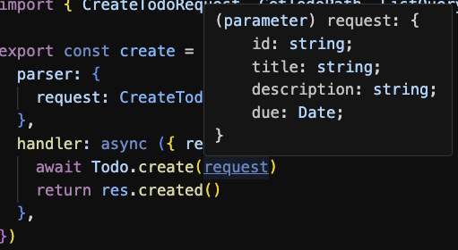
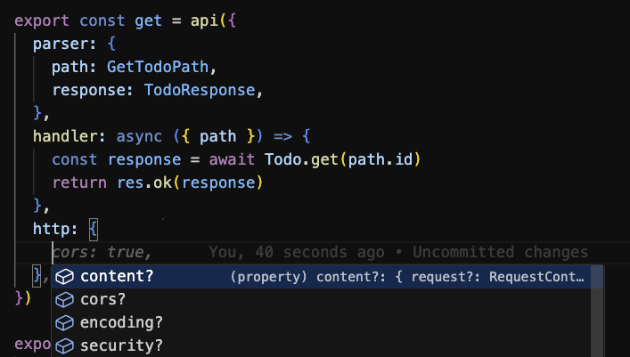

<p align="center">
  
  <p align="center">
    Strongly typed, best practice & simple functional interface for AWS lambda functions
    <br />
  </p>
</p>
<!-- <p align="center">
<a href="https://github.com/colinhacks/zod/actions?query=branch%3Amaster"></a>
<a href="https://twitter.com/colinhacks" rel="nofollow"></a>
<a href="https://opensource.org/licenses/MIT" rel="nofollow"></a>
<a href="https://www.npmjs.com/package/zod" rel="nofollow"></a>
<a href="https://www.npmjs.com/package/zod" rel="nofollow"></a>
<a href="https://discord.gg/KaSRdyX2vc" rel="nofollow"></a>
</p> -->

<div align="center">
  <a href="#">docs</a>
  <span>&nbsp;&nbsp;•&nbsp;&nbsp;</span>
  <a href="https://www.npmjs.com/package/@refactorthis/funcy">npm</a>
  <span>&nbsp;&nbsp;•&nbsp;&nbsp;</span>
  <a href="https://github.com/refactorthis/funcy/issues/new">issues</a>
</div>

<br />

## funcy

- [funcy](#funcy)
- [Introduction](#introduction)
  - [Preview](#preview)
- [Getting Started](#getting-started)
  - [Installation](#installation)
  - [Writing funcy Functions](#writing-funcy-functions)
  - [Examples](#examples)
- [API Definition](#api-definition)
- [Performance Comparisons](#performance-comparisons)
- [Roadmap](#roadmap)
- [See Also](#see-also)
  - [Complementary Packages](#complementary-packages)
  - [Technologies](#technologies)

## Introduction

**funcy** provides a TypeScript-first (fully typed), best practice & simple functional interface for AWS lambda functions. The perfect complement to serverless frameworks such as the [serverless](https://www.serverless.com/framework), [SST](https://sst.dev), [SAM](https://aws.amazon.com/serverless/sam/), etc.

It provides out-of-the-box inferred typing of models, validation, and handles best-practice middleware concerns such as CORS, content negotiation, encoding, monitoring, etc. out of the box, in one simple interface.

The key design principles of funcy are as follows:

- Sensible Defaults - Best practice and sensible options by default. Get going straight away without config.
- Progressive Disclosure - We keep interfaces simple and abstracted. Everything should be customisable, but hidden by default. See [progressive disclosure](https://en.wikipedia.org/wiki/Progressive_disclosure).
- All-In-One - Find everything you need by code-completion. No need to go searching on npm or google to install other packages, this is an all-in-one framework.
- Performant - lazy loading, tree shaking, and profiling of pipelines.
- Extensible - Configurable, and options to extend the middy pipeline where needed.

If you prefer lightweight lambda functions and don't want a full-blown framework (like Nest.js), then this is for you.

### Preview

The example below shows parsing, validating and inferring a strongly-typed model for both request and response.

```typescript
import { api, res } from '@funcy/api'

// create customer handler
export const create = api({
  parser: {
    request: CreateCustomerRequest // zod schema,
    response: CreateCustomerResponse // zod schema,
  },
  handler: async ({ request }) = {
    const response = await Customer.create(request)
    return res.ok(response)
  }
})
```

You'll notice that the handler itself does not contain any parsing, validation or error handling logic, we adhere to the single-responsibility-principle here and handle all other aspects in middleware, configurable at either api or handler level.



As you can see above, the TypeScript type is inferred at compile time, allowing strong typing of all request and response parameters to your API, almost by magic.

funcy also has a full middleware pipeline, allowing you to control things like CORS, content negotiation, encoding, security header best practices, etc. all out of the box. All you need to do is ctrl+space to see the options. Options can either be set as default for the whole api, or overridden for each handler



## Getting Started

### Installation

```bash
pnpm add @funcy/api
#bun add @funcy/api
#yarn add @funcy/api
#npm install --save-dev @funcy/api
```

### Writing funcy Functions

To get started let's create a simple API Gateway Proxy (HTTP or REST) lambda handler. This will validate the request and the response with our predefined zod schemas.

```typescript
import { api, res } from '@funcy/api'

export const handler = api({
  parser: {
    request: MyRequest,
    response: MyResponse,
  },
  handler: async({ request }) = {
    // request is the strongly typed request body
    // response is also validated and strongly typed
    return res.ok(response)
  }
})
```

You can create your own api handlers using api-level defaults. For instance, let's use a custom authorizer context, with strongly typed claims, for use across all of our api.

```typescript
// base-api-handler.ts
import { api } from '@funcy/api'

// my authorizer struct
interface AuthorizerType {
  jwt: { claims: { tenantId: 'string' } }
}

// Create this once for your API and share it
export default api.create<AuthorizerType>()
```

```typescript
// customers-create.ts
import { res } from '@funcy/api'
import api from './base-api-handler.ts'

export const handler = api({
  handler: async({ request, path, query, event, authorizer }) = {
    // request is the strongly typed request body
    // path is the strongly typed url path
    // query is the strongly typed query string
    // event is the raw AWS API proxy event, in case you need it
    // authorizer is the authorizer context as specified in base-api-handler.ts, including strongly typed claims
    // responseType is the strongly typed response type
    return res.ok(responseType)
  }
})
```

### Examples

Let's create CRUD handlers for the "Customer" domain, with request validation.

```typescript
import { api, res } from '@funcy/api'

// create
export const handler = api({
  parser: {
    request: CreateCustomerRequest,
    response: CreateCustomerResponse,
  },
  handler: async ({ request }) = {
    const response = await Customers.create(request)
    return res.created(response)
  }
})

// get
export const handler = api({
  parser: {
    path: GetResourcePath,
    response: GetCustomerResponse,
  },
  handler: async ({ request, path }) = {
    const response = await Customers.get(path.id)
    return res.ok(response)
  }
})

// list
export const handler = api({
  parser: {
    query: ListQueryStringValidator,
  },
  handler: async ({ request, query }) = {
    const { skip, take } = query
    const items = await Customers.list(skip, take)
    return res.ok({ items, skip, take })
  }
})

// update
export const handler = api({
  parser: {
    request: UpdateCustomerRequest,
    response: UpdateCustomerResponse,
    path: GetResourcePath,
  },
  handler: async ({ request, path }) = {
    const response = await Customers.update(path.id, request)
    return res.ok(response)
  }
})
```

## API Definition

// todo

## Performance Comparisons

funcy
Nest.js
Express
Koa

## Roadmap

- Support for other validators
- Verify support for legacy API Gateway proxy integration (< v2)
- Test coverage
- Performance test comparison with nest.js, raw lambda, etc.
- Other lambda integrations (s3, dynamo, etc)
- hateoas middleware
- router middleware for proxy+ calls

## See Also

### Complementary Packages

- [zod](https://github.com/colinhacks/zod) - a great Typescript-first validation framework, which can infer your DTO types automatically
- [zod-to-openapi](https://github.com/asteasolutions/zod-to-openapi) - generate your Open API definition code-first from zod schemas.
- [openapi-zod-client](https://github.com/astahmer/openapi-zod-client) - alternatively, generate your code from your design-first Open API definition

### Technologies

- [middy](https://github.com/middyjs/middy) - powers the funcy pipeline with it's extensible middleware framework.
- [TypeScript](https://github.com/microsoft/TypeScript) - strong-typing is critical for maintainability and reducing bugs.
- [zod](https://github.com/colinhacks/zod) - Developer-friendly, TypeScript validation framework
